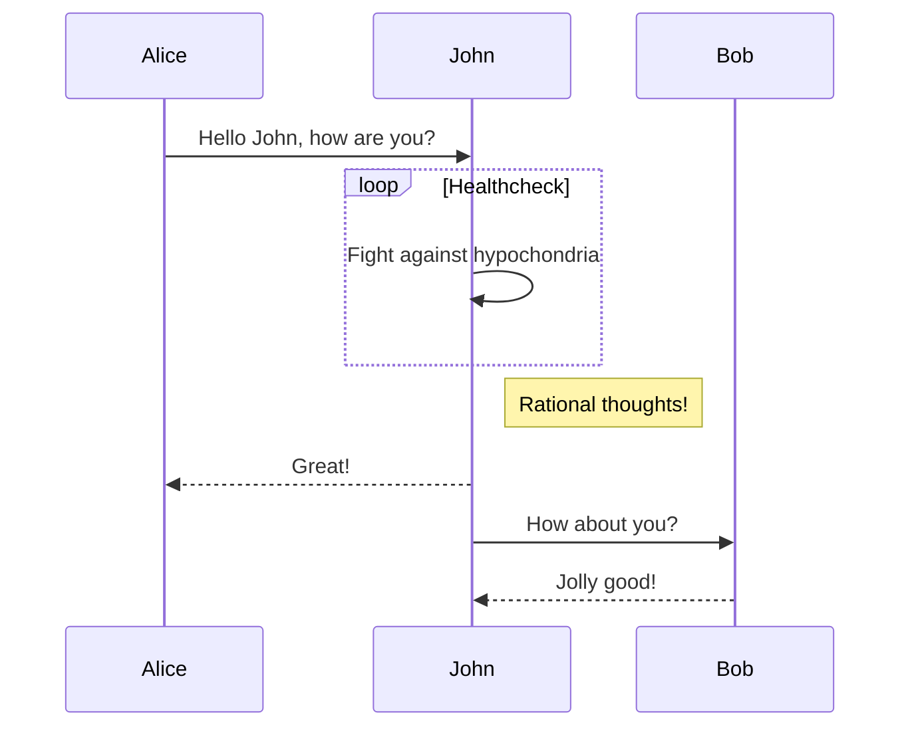

**Preface:** 重载了系统，我的博客又无了，现在吸收了教训，从无到有开始记录以下创建博客的过程。

<!--more-->

### 使用 npm 下载 `hexo-theme-next` 最新版

```shell
$ npm install hexo-theme-next@latest
```

2. 设置 Hexo 主题

编辑 Hexo config file 设置 theme 为 next

```  json  Hexo config file
theme: next
```

这时运行 hexo s 会报错 `Error: Cannot find module 'css'`，下载 css 包就行

```shell
npm install css
```

然后就可以成功启动 next 主题的博客

先跳过 deploy 的过程，先把本地能配的都配好

### Next 配置文件

为了能在未来更新 next 主题，应该把配置文件的信息放在 hexo-site 位置下

- 确保是 hexo 5.0 以后的版本
- 在 hexo-site 创建一个 _config.next.yml 文件
- 在 next theme 中把所有的信息都复制过来

```shell
# Installed through npm
cp node_modules/hexo-theme-next/_config.yml _config.next.yml
```

### 配置 Hexo 信息以及 Next 主题配置

在 _config.yml 下把该填的都填了

#### Sidebar

- 设置 Avatar

在 Next config file 中编辑 avatar 中的 url ，改为图片的位置/地址

- Site State

设置 Next config file 中的 site state 为 true

``` Next config file
site_state: true
```

- Social Link

```json Next config file
social:
  GitHub: https://github.com/yourname || fab fa-github
  E-Mail: mailto:yourname@gmail.com || fa fa-envelope
  Weibo: https://weibo.com/yourname || fab fa-weibo
  Twitter: https://twitter.com/yourname || fab fa-twitter
  FB Page: https://www.facebook.com/yourname || fab fa-facebook
  StackOverflow: https://stackoverflow.com/yourname || fab fa-stack-overflow
  YouTube: https://youtube.com/yourname || fab fa-youtube
  Instagram: https://instagram.com/yourname || fab fa-instagram
  Skype: skype:yourname?call|chat || fab fa-skype
```

其他的按照 Siderbar 的默认设置即可

#### Footer

设置以下备案号，把 power 设置为 false ，copyright之后再设置

#### Posts

- Post Meta Display

默认

- Post Wordcount

不设置，不用

- Tag Icon

设置为 true

- Post Edit

enable 设置为 true

设置 url

For site repository

Link for view source: `url: https://github.com/.../tree/master/source/_posts/`

Link for fork & edit: `url: https://github.com/.../edit/master/source/_posts/`

For post repository

Link for view source: `url: https://github.com/.../_posts/tree/master/`

Link for fork & edit: `url: https://github.com/.../_posts/edit/master/`

- Post Navigation

默认为 left

#### Custom Pages

将 Next config file 的 menu 设置中把所需要的几个 page 前的注释 # 去掉，然后 hexo new page custom-name 创建这几个界面

- 添加 Tag page && categories page

```shell
$ cd hexo-site
$ hexo new page tags
```

然后把 index.md 中的 type 改称 tags

categories 同理

- 添加 Google Calendar page

获取 google api key 和 google calendar key，填入 Next config file 中的位置

添加 schedule page ，类似 tags

#### Misc 设置

- Preconnect
- Mobile device adaption
- Body Scrollbar
- Back to Top
- Font Customization
- Codeblock Style
  - button
  - theme 默认


将 code.fontfamily 设置为 Fira Code

#### SEO

设置 Hexo config file 中的 url ，设置 Next config file 中 index_with_subtitle 为 true

- Google Search Console

在 Next config file 中修改

```json Next config file
google_site_verification: XXXXXXXXXXXXXXXXXXXXXXX
```

#### Mermaid



必须要用 hexo-renderer-marked 才能渲染



```shell NexT config file
# Mermaid tag
mermaid:
  enable: true
  # Available themes: default | dark | forest | neutral
  theme:
    light: default
    dark: dark
```

```shell Hexo config file
highlight:
  exclude_languages:
    - mermaid
```




A[Hard] -->|Text| B(Round)
B --> C{Decision}
C -->|One| D[Result 1]
C -->|Two| E[Result 2]



#### Note

```shell Next config file
note:
  # Note tag style values:
  #  - simple    bs-callout old alert style. Default.
  #  - modern    bs-callout new (v2-v3) alert style.
  #  - flat      flat callout style with background, like on Mozilla or StackOverflow.
  #  - disabled  disable all CSS styles import of note tag.
  style: simple
  icons: false
  # Offset lighter of background in % for modern and flat styles (modern: -12 | 12; flat: -18 | 6).
  # Offset also applied to label tag variables. This option can work with disabled note tag.
  light_bg_offset: 0
```

```

#### Header
(without define class style)

```



##### Header

(without define class style)


```

#### Default Header
Welcome to [Hexo!](https://hexo.io)

```



##### Default Header

Welcome to [Hexo!](https://hexo.io)


```

#### Primary Header
**Welcome** to [Hexo!](https://hexo.io)

```



##### Primary Header

**Welcome** to [Hexo!](https://hexo.io)


```

#### Info Header
**Welcome** to [Hexo!](https://hexo.io)

```



##### Info Header

**Welcome** to [Hexo!](https://hexo.io)


```

#### Success Header
**Welcome** to [Hexo!](https://hexo.io)

```



##### Success Header

**Welcome** to [Hexo!](https://hexo.io)


```

#### Warning Header
**Welcome** to [Hexo!](https://hexo.io)

```



##### Warning Header

**Welcome** to [Hexo!](https://hexo.io)


```

#### Danger Header
**Welcome** to [Hexo!](https://hexo.io)

```



##### Danger Header

**Welcome** to [Hexo!](https://hexo.io)


```

#### No icon note
Note **without** icon: `note info no-icon`

```



##### No icon note

Note **without** icon: `note info no-icon`


```

#### Details and summary
Note with summary: `note primary This is a summary`

```



##### Details and summary

Note with summary: `note primary This is a summary`


```

#### Details and summary (No icon)
Note with summary: `note info no-icon This is a summary`

```



##### Details and summary (No icon)

Note with summary: `note info no-icon This is a summary`


````

#### Codeblock in note

```
code block in note tag
code block in note tag
code block in note tag
```

````



##### Codeblock in note

```
code block in note tag
code block in note tag
code block in note tag
```


```

#### Lists in note
* ul
* ul
    * ul
    * ul
* ul

1. ol
2. ol
    1. ol
    2. ol
3. ol

```



##### Lists in note

* ul
* ul
    * ul
    * ul
* ul

1. ol
2. ol
    1. ol
    2. ol
3. ol
    

```
#### Table in Note

| 1 | 2 |
| - | - |
| 3 | 4 |
| 5 | 6 |
| 7 | 8 |

```

##### Table in Note


| 1    | 2    |
| :--- | ---- |
| 3    | 4    |
| 5    | 6    |
| 7    | 8    |



#### Tabs

```shell Next config file
tabs:
  # Make the nav bar of tabs with long content stick to the top.
  sticky: false
  transition:
    tabs: false
    labels: true
```

```

<!-- tab -->
**This is Tab 1.**
<!-- endtab -->

<!-- tab -->
**This is Tab 2.**
<!-- endtab -->

<!-- tab -->
**This is Tab 3.**
<!-- endtab -->

```


<!-- tab -->
**This is Tab 1.**
<!-- endtab -->

<!-- tab -->
**This is Tab 2.**
<!-- endtab -->

<!-- tab -->
**This is Tab 3.**
<!-- endtab -->


##### Tabs with 3rd tab selected

```

<!-- tab -->
**This is Tab 1.**
<!-- endtab -->

<!-- tab -->
**This is Tab 2.**
<!-- endtab -->

<!-- tab -->
**This is Tab 3.**
<!-- endtab -->

```


<!-- tab -->
**This is Tab 1.**
<!-- endtab -->

<!-- tab -->
**This is Tab 2.**
<!-- endtab -->

<!-- tab -->
**This is Tab 3.**
<!-- endtab -->


##### Tabs with no tab selected

```

<!-- tab -->
**This is Tab 1.**
<!-- endtab -->

<!-- tab -->
**This is Tab 2.**
<!-- endtab -->

<!-- tab -->
**This is Tab 3.**
<!-- endtab -->

```


<!-- tab -->
**This is Tab 1.**
<!-- endtab -->

<!-- tab -->
**This is Tab 2.**
<!-- endtab -->

<!-- tab -->
**This is Tab 3.**
<!-- endtab -->


##### Tabs with custom labels

```

<!-- tab Solution 1 -->
**This is Tab 1.**
<!-- endtab -->

<!-- tab Solution 2 -->
**This is Tab 2.**
<!-- endtab -->

<!-- tab Solution 3 -->
**This is Tab 3.**
<!-- endtab -->

```


<!-- tab Solution 1 -->
**This is Tab 1.**
<!-- endtab -->

<!-- tab Solution 2 -->
**This is Tab 2.**
<!-- endtab -->

<!-- tab Solution 3 -->
**This is Tab 3.**
<!-- endtab -->


##### Tabs with icons only

```

<!-- tab @text-width -->
**This is Tab 1.**
<!-- endtab -->

<!-- tab @font -->
**This is Tab 2.**
<!-- endtab -->

<!-- tab @bold -->
**This is Tab 3.**
<!-- endtab -->

```


<!-- tab @text-width -->
**This is Tab 1.**
<!-- endtab -->

<!-- tab @font -->
**This is Tab 2.**
<!-- endtab -->

<!-- tab @bold -->
**This is Tab 3.**
<!-- endtab -->


##### Tabs with icons and labels

```

<!-- tab Solution 1@text-width -->
**This is Tab 1.**
<!-- endtab -->

<!-- tab Solution 2@font -->
**This is Tab 2.**
<!-- endtab -->

<!-- tab Solution 3@bold -->
**This is Tab 3.**
<!-- endtab -->

```


<!-- tab Solution 1@text-width -->
**This is Tab 1.**
<!-- endtab -->

<!-- tab Solution 2@font -->
**This is Tab 2.**
<!-- endtab -->

<!-- tab Solution 3@bold -->
**This is Tab 3.**
<!-- endtab -->


##### Tabs permalinks test

```
Permalink for > [Tab one](#tab-one).
Permalink for > [Tab one 1](#tab-one-1).
Permalink for > [Tab one 2](#tab-one-2).
Permalink for > [Tab one 3](#tab-one-3).

Permalink for > [Tab two](#tab-two).
Permalink for > [Tab two 1](#tab-two-1).
Permalink for > [Tab two 2](#tab-two-2).
Permalink for > [Tab two 3](#tab-two-3).


<!-- tab -->
**This is Tab 1.**
<!-- endtab -->

<!-- tab -->
**This is Tab 2.**
<!-- endtab -->

<!-- tab -->
**This is Tab 3.**
<!-- endtab -->



<!-- tab -->
**This is Tab 1.**
<!-- endtab -->

<!-- tab -->
**This is Tab 2.**
<!-- endtab -->

<!-- tab -->
**This is Tab 3.**
<!-- endtab -->

```

Permalink for > [Tab one](#tab-one).
Permalink for > [Tab one 1](#tab-one-1).
Permalink for > [Tab one 2](#tab-one-2).
Permalink for > [Tab one 3](#tab-one-3).

Permalink for > [Tab two](#tab-two).
Permalink for > [Tab two 1](#tab-two-1).
Permalink for > [Tab two 2](#tab-two-2).
Permalink for > [Tab two 3](#tab-two-3).


<!-- tab -->
**This is Tab 1.**
<!-- endtab -->

<!-- tab -->
**This is Tab 2.**
<!-- endtab -->

<!-- tab -->
**This is Tab 3.**
<!-- endtab -->



<!-- tab -->
**This is Tab 1.**
<!-- endtab -->

<!-- tab -->
**This is Tab 2.**
<!-- endtab -->

<!-- tab -->
**This is Tab 3.**
<!-- endtab -->


##### Tabs with other tags

```

<!-- tab -->
**This is Tab 1.**

1. One
2. Two
3. Three

Indented code block:

    nano /etc

Tagged code block:


code tag
code tag
code tag



Note default tag.

<!-- endtab -->

<!-- tab -->
**This is Tab 2.**

* Five
* Six
* Seven




<!-- endtab -->

<!-- tab -->
**This is Tab 3.**


<!-- tab -->
**This is Sub Tab 1.**

Lorem ipsum dolor sit amet, consectetuer adipiscing elit. Phasellus hendrerit. Pellentesque aliquet nibh nec urna. In nisi neque, aliquet vel, dapibus id, mattis vel, nisi. Sed pretium, ligula sollicitudin laoreet viverra, tortor libero sodales leo, eget blandit nunc tortor eu nibh. Nullam mollis. Ut justo. Suspendisse potenti. Pellentesque fermentum dolor. Aliquam quam lectus, facilisis auctor, ultrices ut, elementum vulputate, nunc.


Sed egestas, ante et vulputate volutpat, eros pede semper est, vitae luctus metus libero eu augue. Morbi purus libero, faucibus adipiscing, commodo quis, gravida id, est. Sed lectus. Praesent elementum hendrerit tortor. Sed semper lorem at felis. Vestibulum volutpat, lacus a ultrices sagittis, mi neque euismod dui, eu pulvinar nunc sapien ornare nisl. Phasellus pede arcu, dapibus eu, fermentum et, dapibus sed, urna.


Morbi interdum mollis sapien. Sed ac risus. Phasellus lacinia, magna a ullamcorper laoreet, lectus arcu pulvinar risus, vitae facilisis libero dolor a purus. Sed vel lacus. Mauris nibh felis, adipiscing varius, adipiscing in, lacinia vel, tellus. Suspendisse ac urna. Etiam pellentesque mauris ut lectus. Nunc tellus ante, mattis eget, gravida vitae, ultricies ac, leo. Integer leo pede, ornare a, lacinia eu, vulputate vel, nisl.

<!-- endtab -->

<!-- tab -->
**This is Sub Tab 2.**

Lorem ipsum dolor sit amet, consectetuer adipiscing elit. Phasellus hendrerit. Pellentesque aliquet nibh nec urna. In nisi neque, aliquet vel, dapibus id, mattis vel, nisi. Sed pretium, ligula sollicitudin laoreet viverra, tortor libero sodales leo, eget blandit nunc tortor eu nibh. Nullam mollis. Ut justo. Suspendisse potenti. Pellentesque fermentum dolor. Aliquam quam lectus, facilisis auctor, ultrices ut, elementum vulputate, nunc.

Sed egestas, ante et vulputate volutpat, eros pede semper est, vitae luctus metus libero eu augue. Morbi purus libero, faucibus adipiscing, commodo quis, gravida id, est. Sed lectus. Praesent elementum hendrerit tortor. Sed semper lorem at felis. Vestibulum volutpat, lacus a ultrices sagittis, mi neque euismod dui, eu pulvinar nunc sapien ornare nisl. Phasellus pede arcu, dapibus eu, fermentum et, dapibus sed, urna.


Morbi interdum mollis sapien. Sed ac risus. Phasellus lacinia, magna a ullamcorper laoreet, lectus arcu pulvinar risus, vitae facilisis libero dolor a purus. Sed vel lacus. Mauris nibh felis, adipiscing varius, adipiscing in, lacinia vel, tellus. Suspendisse ac urna. Etiam pellentesque mauris ut lectus. Nunc tellus ante, mattis eget, gravida vitae, ultricies ac, leo. Integer leo pede, ornare a, lacinia eu, vulputate vel, nisl.


<!-- endtab -->

<!-- tab -->
**This is Sub Tab 3.**


<!-- tab -->
**This is Sub-Sub Tab 1 of Sub Tab 3.**

Lorem ipsum dolor sit amet, consectetuer adipiscing elit. Phasellus hendrerit. Pellentesque aliquet nibh nec urna. In nisi neque, aliquet vel, dapibus id, mattis vel, nisi. Sed pretium, ligula sollicitudin laoreet viverra, tortor libero sodales leo, eget blandit nunc tortor eu nibh. Nullam mollis. Ut justo. Suspendisse potenti. Pellentesque fermentum dolor. Aliquam quam lectus, facilisis auctor, ultrices ut, elementum vulputate, nunc.

Sed egestas, ante et vulputate volutpat, eros pede semper est, vitae luctus metus libero eu augue. Morbi purus libero, faucibus adipiscing, commodo quis, gravida id, est. Sed lectus. Praesent elementum hendrerit tortor. Sed semper lorem at felis. Vestibulum volutpat, lacus a ultrices sagittis, mi neque euismod dui, eu pulvinar nunc sapien ornare nisl. Phasellus pede arcu, dapibus eu, fermentum et, dapibus sed, urna.

Morbi interdum mollis sapien. Sed ac risus. Phasellus lacinia, magna a ullamcorper laoreet, lectus arcu pulvinar risus, vitae facilisis libero dolor a purus. Sed vel lacus. Mauris nibh felis, adipiscing varius, adipiscing in, lacinia vel, tellus. Suspendisse ac urna. Etiam pellentesque mauris ut lectus. Nunc tellus ante, mattis eget, gravida vitae, ultricies ac, leo. Integer leo pede, ornare a, lacinia eu, vulputate vel, nisl.

<!-- endtab -->

<!-- tab -->
**This is Sub-Sub Tab 2 of Sub Tab 3.**

Lorem ipsum dolor sit amet, consectetuer adipiscing elit. Phasellus hendrerit. Pellentesque aliquet nibh nec urna. In nisi neque, aliquet vel, dapibus id, mattis vel, nisi. Sed pretium, ligula sollicitudin laoreet viverra, tortor libero sodales leo, eget blandit nunc tortor eu nibh. Nullam mollis. Ut justo. Suspendisse potenti. Pellentesque fermentum dolor. Aliquam quam lectus, facilisis auctor, ultrices ut, elementum vulputate, nunc.


Sed egestas, ante et vulputate volutpat, eros pede semper est, vitae luctus metus libero eu augue. Morbi purus libero, faucibus adipiscing, commodo quis, gravida id, est. Sed lectus. Praesent elementum hendrerit tortor. Sed semper lorem at felis. Vestibulum volutpat, lacus a ultrices sagittis, mi neque euismod dui, eu pulvinar nunc sapien ornare nisl. Phasellus pede arcu, dapibus eu, fermentum et, dapibus sed, urna.

Morbi interdum mollis sapien. Sed ac risus. Phasellus lacinia, magna a ullamcorper laoreet, lectus arcu pulvinar risus, vitae facilisis libero dolor a purus. Sed vel lacus. Mauris nibh felis, adipiscing varius, adipiscing in, lacinia vel, tellus. Suspendisse ac urna. Etiam pellentesque mauris ut lectus. Nunc tellus ante, mattis eget, gravida vitae, ultricies ac, leo. Integer leo pede, ornare a, lacinia eu, vulputate vel, nisl.



<!-- endtab -->

<!-- tab -->
**This is Sub-Sub Tab 3 of Sub Tab 3.**


Lorem ipsum dolor sit amet, consectetuer adipiscing elit. Phasellus hendrerit. Pellentesque aliquet nibh nec urna. In nisi neque, aliquet vel, dapibus id, mattis vel, nisi. Sed pretium, ligula sollicitudin laoreet viverra, tortor libero sodales leo, eget blandit nunc tortor eu nibh. Nullam mollis. Ut justo. Suspendisse potenti. Pellentesque fermentum dolor. Aliquam quam lectus, facilisis auctor, ultrices ut, elementum vulputate, nunc.


Sed egestas, ante et vulputate volutpat, eros pede semper est, vitae luctus metus libero eu augue. Morbi purus libero, faucibus adipiscing, commodo quis, gravida id, est. Sed lectus. Praesent elementum hendrerit tortor. Sed semper lorem at felis. Vestibulum volutpat, lacus a ultrices sagittis, mi neque euismod dui, eu pulvinar nunc sapien ornare nisl. Phasellus pede arcu, dapibus eu, fermentum et, dapibus sed, urna.


Morbi interdum mollis sapien. Sed ac risus. Phasellus lacinia, magna a ullamcorper laoreet, lectus arcu pulvinar risus, vitae facilisis libero dolor a purus. Sed vel lacus. Mauris nibh felis, adipiscing varius, adipiscing in, lacinia vel, tellus. Suspendisse ac urna. Etiam pellentesque mauris ut lectus. Nunc tellus ante, mattis eget, gravida vitae, ultricies ac, leo. Integer leo pede, ornare a, lacinia eu, vulputate vel, nisl.





<!-- endtab -->


<!-- endtab -->


<!-- endtab -->

```


<!-- tab -->
**This is Tab 1.**

1. One
2. Two
3. Three

Indented code block:

    nano /etc

Tagged code block:


code tag
code tag
code tag



Note default tag.

<!-- endtab -->

<!-- tab -->
**This is Tab 2.**

* Five
* Six
* Seven




<!-- endtab -->

<!-- tab -->
**This is Tab 3.**


<!-- tab -->
**This is Sub Tab 1.**

Lorem ipsum dolor sit amet, consectetuer adipiscing elit. Phasellus hendrerit. Pellentesque aliquet nibh nec urna. In nisi neque, aliquet vel, dapibus id, mattis vel, nisi. Sed pretium, ligula sollicitudin laoreet viverra, tortor libero sodales leo, eget blandit nunc tortor eu nibh. Nullam mollis. Ut justo. Suspendisse potenti. Pellentesque fermentum dolor. Aliquam quam lectus, facilisis auctor, ultrices ut, elementum vulputate, nunc.


Sed egestas, ante et vulputate volutpat, eros pede semper est, vitae luctus metus libero eu augue. Morbi purus libero, faucibus adipiscing, commodo quis, gravida id, est. Sed lectus. Praesent elementum hendrerit tortor. Sed semper lorem at felis. Vestibulum volutpat, lacus a ultrices sagittis, mi neque euismod dui, eu pulvinar nunc sapien ornare nisl. Phasellus pede arcu, dapibus eu, fermentum et, dapibus sed, urna.


Morbi interdum mollis sapien. Sed ac risus. Phasellus lacinia, magna a ullamcorper laoreet, lectus arcu pulvinar risus, vitae facilisis libero dolor a purus. Sed vel lacus. Mauris nibh felis, adipiscing varius, adipiscing in, lacinia vel, tellus. Suspendisse ac urna. Etiam pellentesque mauris ut lectus. Nunc tellus ante, mattis eget, gravida vitae, ultricies ac, leo. Integer leo pede, ornare a, lacinia eu, vulputate vel, nisl.

<!-- endtab -->

<!-- tab -->
**This is Sub Tab 2.**

Lorem ipsum dolor sit amet, consectetuer adipiscing elit. Phasellus hendrerit. Pellentesque aliquet nibh nec urna. In nisi neque, aliquet vel, dapibus id, mattis vel, nisi. Sed pretium, ligula sollicitudin laoreet viverra, tortor libero sodales leo, eget blandit nunc tortor eu nibh. Nullam mollis. Ut justo. Suspendisse potenti. Pellentesque fermentum dolor. Aliquam quam lectus, facilisis auctor, ultrices ut, elementum vulputate, nunc.

Sed egestas, ante et vulputate volutpat, eros pede semper est, vitae luctus metus libero eu augue. Morbi purus libero, faucibus adipiscing, commodo quis, gravida id, est. Sed lectus. Praesent elementum hendrerit tortor. Sed semper lorem at felis. Vestibulum volutpat, lacus a ultrices sagittis, mi neque euismod dui, eu pulvinar nunc sapien ornare nisl. Phasellus pede arcu, dapibus eu, fermentum et, dapibus sed, urna.


Morbi interdum mollis sapien. Sed ac risus. Phasellus lacinia, magna a ullamcorper laoreet, lectus arcu pulvinar risus, vitae facilisis libero dolor a purus. Sed vel lacus. Mauris nibh felis, adipiscing varius, adipiscing in, lacinia vel, tellus. Suspendisse ac urna. Etiam pellentesque mauris ut lectus. Nunc tellus ante, mattis eget, gravida vitae, ultricies ac, leo. Integer leo pede, ornare a, lacinia eu, vulputate vel, nisl.


<!-- endtab -->

<!-- tab -->
**This is Sub Tab 3.**


<!-- tab -->
**This is Sub-Sub Tab 1 of Sub Tab 3.**

Lorem ipsum dolor sit amet, consectetuer adipiscing elit. Phasellus hendrerit. Pellentesque aliquet nibh nec urna. In nisi neque, aliquet vel, dapibus id, mattis vel, nisi. Sed pretium, ligula sollicitudin laoreet viverra, tortor libero sodales leo, eget blandit nunc tortor eu nibh. Nullam mollis. Ut justo. Suspendisse potenti. Pellentesque fermentum dolor. Aliquam quam lectus, facilisis auctor, ultrices ut, elementum vulputate, nunc.

Sed egestas, ante et vulputate volutpat, eros pede semper est, vitae luctus metus libero eu augue. Morbi purus libero, faucibus adipiscing, commodo quis, gravida id, est. Sed lectus. Praesent elementum hendrerit tortor. Sed semper lorem at felis. Vestibulum volutpat, lacus a ultrices sagittis, mi neque euismod dui, eu pulvinar nunc sapien ornare nisl. Phasellus pede arcu, dapibus eu, fermentum et, dapibus sed, urna.

Morbi interdum mollis sapien. Sed ac risus. Phasellus lacinia, magna a ullamcorper laoreet, lectus arcu pulvinar risus, vitae facilisis libero dolor a purus. Sed vel lacus. Mauris nibh felis, adipiscing varius, adipiscing in, lacinia vel, tellus. Suspendisse ac urna. Etiam pellentesque mauris ut lectus. Nunc tellus ante, mattis eget, gravida vitae, ultricies ac, leo. Integer leo pede, ornare a, lacinia eu, vulputate vel, nisl.

<!-- endtab -->

<!-- tab -->
**This is Sub-Sub Tab 2 of Sub Tab 3.**

Lorem ipsum dolor sit amet, consectetuer adipiscing elit. Phasellus hendrerit. Pellentesque aliquet nibh nec urna. In nisi neque, aliquet vel, dapibus id, mattis vel, nisi. Sed pretium, ligula sollicitudin laoreet viverra, tortor libero sodales leo, eget blandit nunc tortor eu nibh. Nullam mollis. Ut justo. Suspendisse potenti. Pellentesque fermentum dolor. Aliquam quam lectus, facilisis auctor, ultrices ut, elementum vulputate, nunc.


Sed egestas, ante et vulputate volutpat, eros pede semper est, vitae luctus metus libero eu augue. Morbi purus libero, faucibus adipiscing, commodo quis, gravida id, est. Sed lectus. Praesent elementum hendrerit tortor. Sed semper lorem at felis. Vestibulum volutpat, lacus a ultrices sagittis, mi neque euismod dui, eu pulvinar nunc sapien ornare nisl. Phasellus pede arcu, dapibus eu, fermentum et, dapibus sed, urna.

Morbi interdum mollis sapien. Sed ac risus. Phasellus lacinia, magna a ullamcorper laoreet, lectus arcu pulvinar risus, vitae facilisis libero dolor a purus. Sed vel lacus. Mauris nibh felis, adipiscing varius, adipiscing in, lacinia vel, tellus. Suspendisse ac urna. Etiam pellentesque mauris ut lectus. Nunc tellus ante, mattis eget, gravida vitae, ultricies ac, leo. Integer leo pede, ornare a, lacinia eu, vulputate vel, nisl.



<!-- endtab -->

<!-- tab -->
**This is Sub-Sub Tab 3 of Sub Tab 3.**


Lorem ipsum dolor sit amet, consectetuer adipiscing elit. Phasellus hendrerit. Pellentesque aliquet nibh nec urna. In nisi neque, aliquet vel, dapibus id, mattis vel, nisi. Sed pretium, ligula sollicitudin laoreet viverra, tortor libero sodales leo, eget blandit nunc tortor eu nibh. Nullam mollis. Ut justo. Suspendisse potenti. Pellentesque fermentum dolor. Aliquam quam lectus, facilisis auctor, ultrices ut, elementum vulputate, nunc.


Sed egestas, ante et vulputate volutpat, eros pede semper est, vitae luctus metus libero eu augue. Morbi purus libero, faucibus adipiscing, commodo quis, gravida id, est. Sed lectus. Praesent elementum hendrerit tortor. Sed semper lorem at felis. Vestibulum volutpat, lacus a ultrices sagittis, mi neque euismod dui, eu pulvinar nunc sapien ornare nisl. Phasellus pede arcu, dapibus eu, fermentum et, dapibus sed, urna.


Morbi interdum mollis sapien. Sed ac risus. Phasellus lacinia, magna a ullamcorper laoreet, lectus arcu pulvinar risus, vitae facilisis libero dolor a purus. Sed vel lacus. Mauris nibh felis, adipiscing varius, adipiscing in, lacinia vel, tellus. Suspendisse ac urna. Etiam pellentesque mauris ut lectus. Nunc tellus ante, mattis eget, gravida vitae, ultricies ac, leo. Integer leo pede, ornare a, lacinia eu, vulputate vel, nisl.





<!-- endtab -->


<!-- endtab -->


<!-- endtab -->



#### Centered Quote

```
Something
```



这里遇到了错误，无法加载上面的引用

**解决：**

```shell
npm install hexo-renderer-swig
```



Something

#### Video

```


```



### Third party plugin

#### Pjax 加速浏览

``` shell Next config file
# Easily enable fast Ajax navigation on your website.
# For more information: https://github.com/next-theme/pjax
pjax: true
```

```shell
npm install pjax
```

#### Math Equations

```shell Next file config
math:
  ...
  mathjax:
    enable: true
```

```shell
$ npm un hexo-renderer-marked
$ npm i hexo-renderer-pandoc
```

```shell
$ hexo clean && hexo g -d
# or hexo clean && hexo s
```

$$
\begin{equation}
E = mc^2
\end{equation}
$$

$$
\begin{equation*}
e^{\pi i} + 1 = 0
\end{equation*}
$$


In equation $\eqref{eq:tag_i}$, we find the value of an
interesting integral:
$$
\begin{equation}
  \int_0^\infty \frac{x^3} {e^x-1}\,dx = \frac{\pi^4}{15}
  \tag{i}
  \label{eq:tag_i}
\end{equation}
$$

#### Comments

Disqus is a global comment system that improves discussion on websites and connects conversations across the web.

1. Create an account and log into [Disqus](https://disqus.com/). Once logged in, click the `GET STARTED` button on the homepage, then select `I want to install Disqus on my site` option and you will see the `Create a new site` interface.
2. Enter your `Website Name`, which will serve as your Disqus shortname, and select a Category from the drop-down menu. Then click `Create Site` button.
3. Choose `I don't see my platform listed, install manually with Universal Code`, configure Disqus for your site, and click `Complete Setup` button.
4. Set the value `enable` to `true`, add the obtained Disqus shortname (`shortname`), and edit other configurations in `disqus` section in the NexT config file as following:

```shell Next config file
disqus:
  enable: false
  shortname: your-short-disqus-name
  count: true
```

#### Analytics

前往 [Google analytics](https://analytics.google.com/) 获取 track id，填入 Next config file 中

#### LeanCloud Counting

```shell
npm install hexo-leancloud-counter-security
```

登陆 LeanCloud 获取 AppID & APPKey， 在 Hexo config file 中加入

```shell Hexo cinfig file
leancloud_counter_security:
  enable_sync: true
  app_id: <your app id>
  app_key: <your app key>
  username: <your username> # Will be asked while deploying if is left blank
  password: <your password> # Recommmended to be left blank. Will be asked while deploying if is left blank
```

在 Next config file 中修改

```shell Next config file
# Show number of visitors to each article.
# You can visit https://www.leancloud.cn get AppID and AppKey.
leancloud_visitors:
  enable: true
  app_id: #<app_id>
  app_key: #<app_key>
  # Required for apps from CN region
  server_url: # <your server url>
  # Dependencies: https://github.com/theme-next/hexo-leancloud-counter-security
  # If you don't care about security in lc counter and just want to use it directly
  # (without hexo-leancloud-counter-security plugin), set the `security` to `false`.
  security: true
```

#### Local Search

```shell
$ npm install hexo-generator-searchdb
```

Hexo config file 中添加

```shell Hexo config file
search:
  path: search.xml
  field: post
  content: true
  format: html
```

```shell Next config file 
# Local search
# Dependencies: https://github.com/next-theme/hexo-generator-searchdb
local_search:
  enable: true
  # If auto, trigger search by changing input.
  # If manual, trigger search by pressing enter key or search button.
  trigger: auto
  # Show top n results per article, show all results by setting to -1
  top_n_per_article: 1
  # Unescape html strings to the readable one.
  unescape: false
  # Preload the search data when the page loads.
  preload: false
```

#### Fancybox

```shell Next config file
fancybox: true
```

#### Pangu Autospace

自动在中文和英文之间加上一个空格

```shell Next config file 
# Pangu Support
pangu: true
```

#### Quicklink

[Quicklink](https://github.com/GoogleChromeLabs/quicklink) is a JavaScript plugin that faster subsequent page-loads by prefetching in-viewport links during idle time. Chrome, Firefox, Edge are supported without polyfills.

```shell Next config file
...
quicklink:
  enable: true
  home: true
  archive: true
  delay: true
  timeout: 3000
  priority: true
...
```

#### Animation Effect

加载动画

```shell Next config file
# Use Animate.css to animate everything.
# For more information: https://animate.style
motion:
  enable: true
  async: false
  transition:
    # All available Transition variants: https://theme-next.js.org/animate/
    post_block: fadeIn
    post_header: fadeInDown
    post_body: fadeInDown
    coll_header: fadeInLeft
    # Only for Pisces | Gemini.
    sidebar: fadeInUp
```

#### Progress Bar

```shell Next config file
pace:
  enable: true
  # All available colors:
  # black | blue | green | orange | pink | purple | red | silver | white | yellow
  color: black
  # All available themes:
  # big-counter | bounce | barber-shop | center-atom | center-circle | center-radar | center-simple
  # corner-indicator | fill-left | flat-top | flash | loading-bar | mac-osx | material | minimal
  theme: big-counter
```

### Advanced Settings

#### CDN Settings

用 CDN 加速插件和静态资源的加载

```shell Next config file
vendors:
  # The CDN provider of NexT internal scripts.
  # Available values: local | jsdelivr | unpkg | cdnjs | custom
  # Warning: If you are using the latest master branch of NexT, please set `internal: local`
  internal: local
  # The default CDN provider of third-party plugins.
  # Available values: local | jsdelivr | unpkg | cdnjs | custom
  # Dependencies for `plugins: local`: https://github.com/next-theme/plugins
  plugins: unpkg
  # Custom CDN URL
  # For example:
  # custom_cdn_url: https://cdn.jsdelivr.net/npm/${npm_name}@${version}/${minified}
  # custom_cdn_url: https://cdnjs.cloudflare.com/ajax/libs/${cdnjs_name}/${version}/${cdnjs_file}
  custom_cdn_url:
```

### 部署

一键部署

```shell 
$ npm install hexo-deployer-git
```

```shell Hexo config file
deploy:
  type: git
  repo: https://github.com/<username>/<project>
  # example, https://github.com/hexojs/hexojs.github.io
  branch: gh-pages
```

